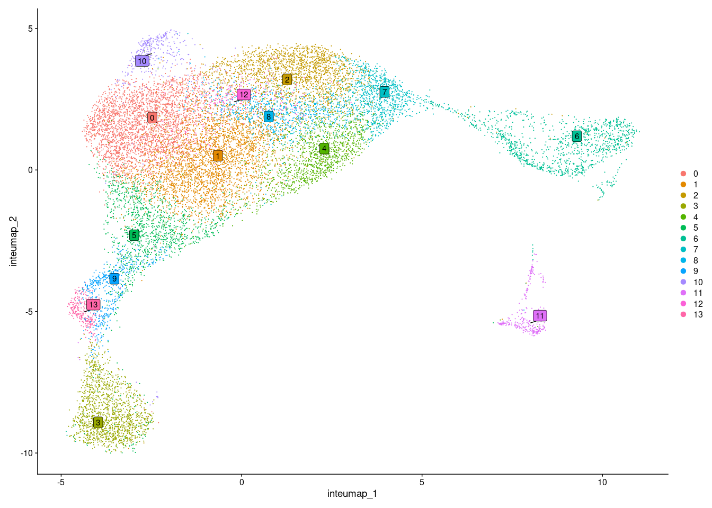
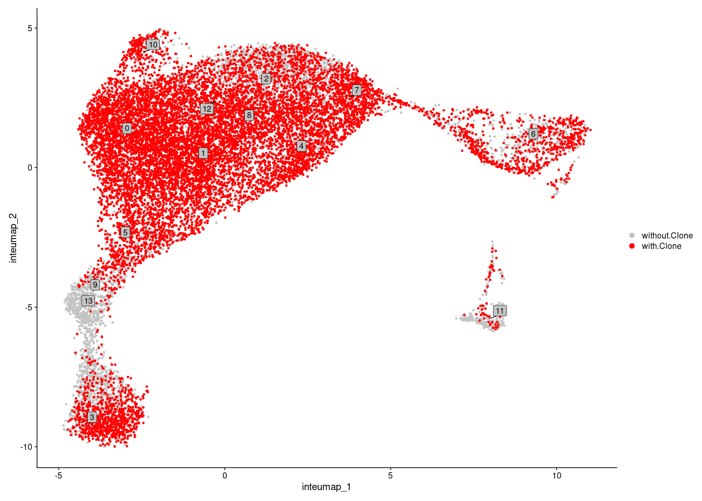
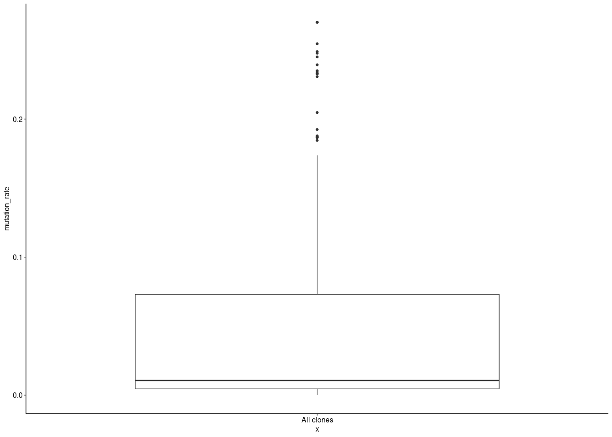
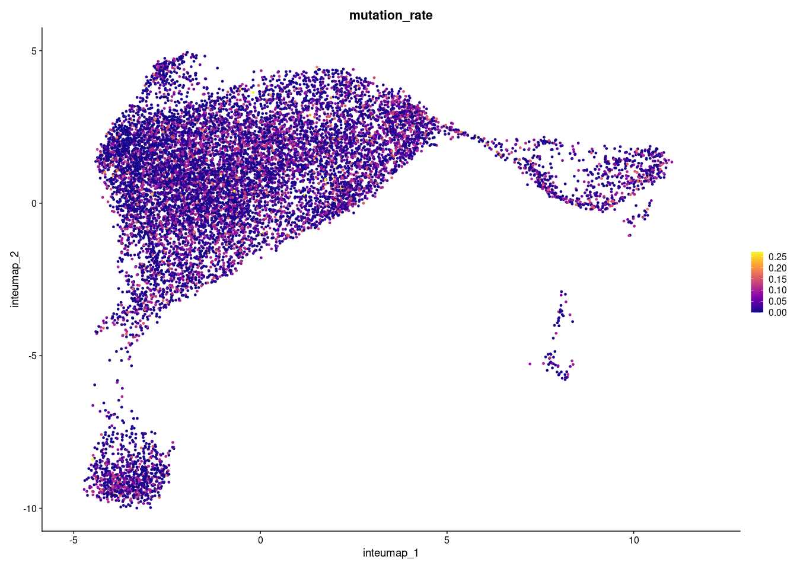
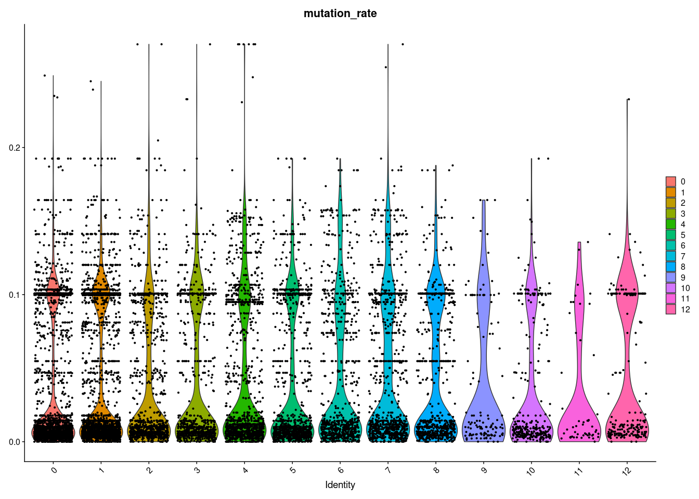
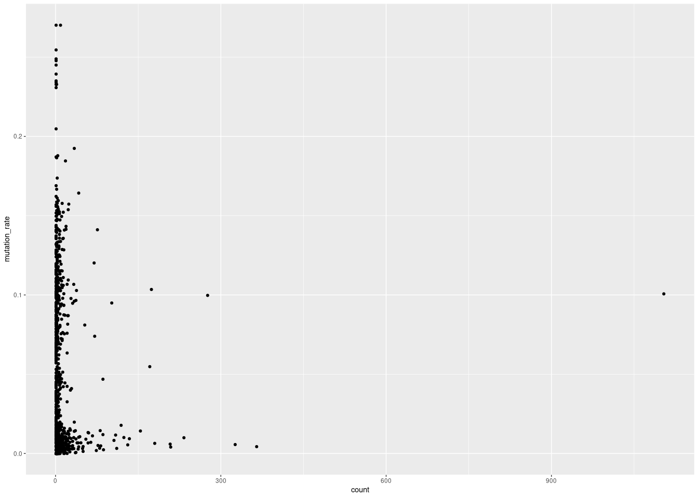
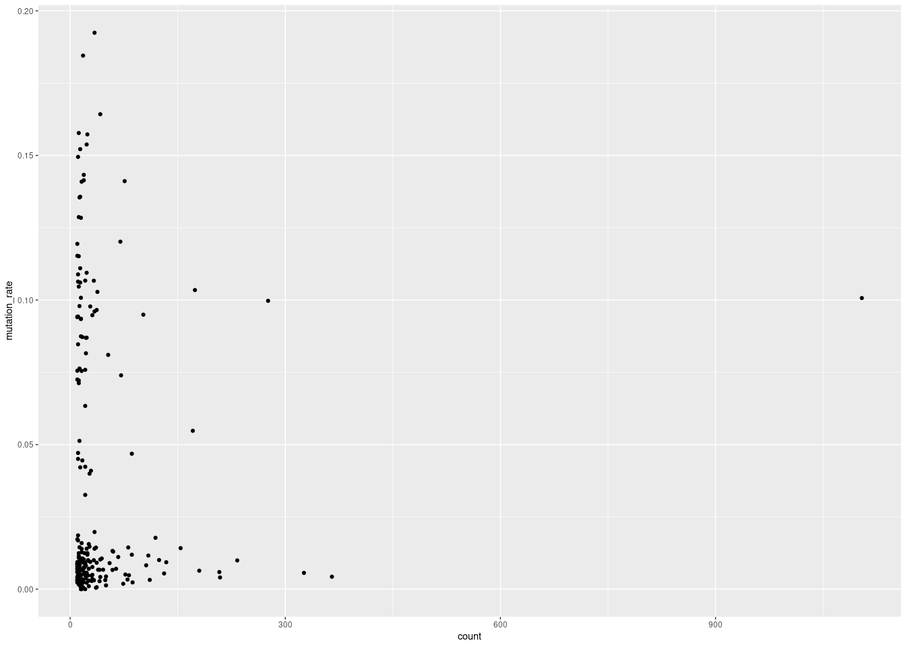
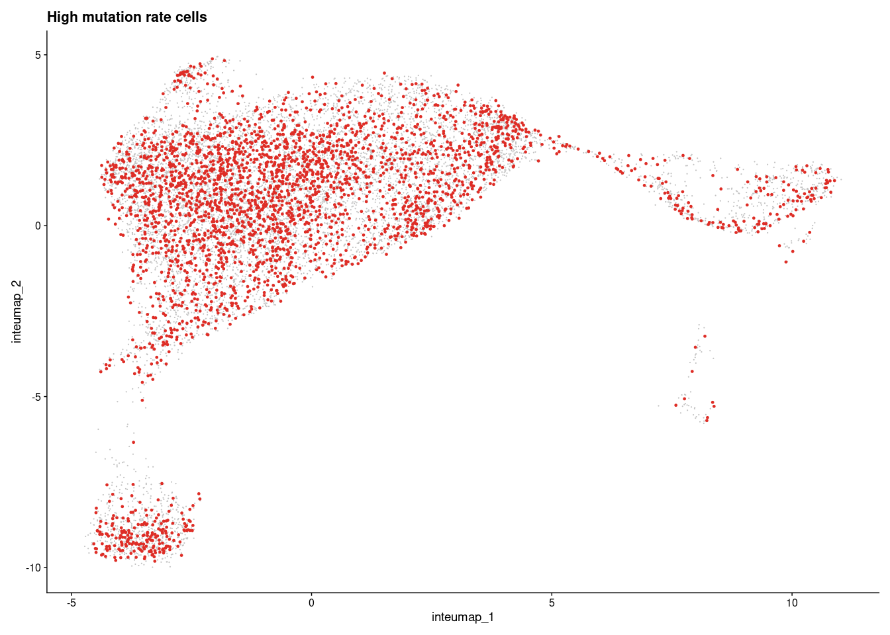
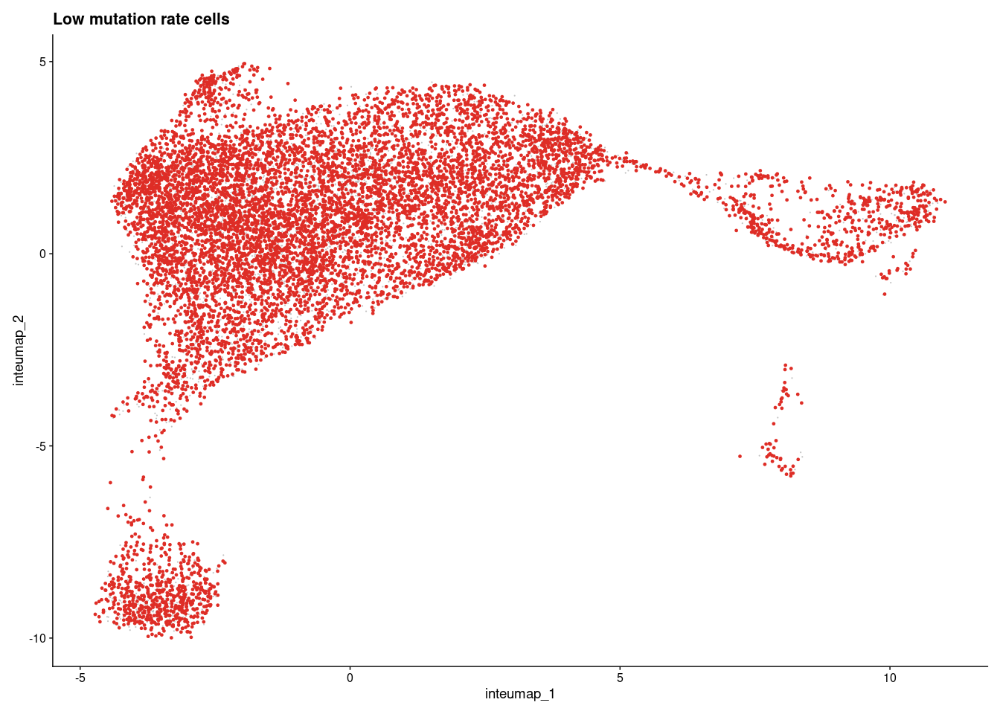

<style type="text/css">
script src = "https://ajax.googleapis.com/ajax/libs/jquery/3.4.1/jquery.min.js"
</style>

<script>
 $(document).ready(function() {
    $('body').prepend('<div class=\"zoomDiv\"></div>');
    // onClick function for all plots (img's)
    $('img:not(.zoomImg)').click(function() {
      $('.zoomImg').attr('src', $(this).attr('src')).css({width: '100%'});
      $('.zoomDiv').css({opacity: '1', width: 'auto', border: '1px solid white', borderRadius: '5px', position: 'fixed', top: '50%', left: '50%', marginRight: '-50%', transform: 'translate(-50%, -50%)', boxShadow: '0px 0px 50px #888888', zIndex: '50', overflow: 'auto', maxHeight: '100%'});
    });
    // onClick function for zoomImg
    $('img.zoomImg').click(function() {
      $('.zoomDiv').css({opacity: '0', width: '0%'}); 
    });
  });
</script>

<style type="text/css">
    div.datatables { height: auto !important;}
</style>


# UMAP

## All samples, grouped by clusters
<!-- -->

## All samples, highlighted cells with clone VDJ information
<!-- -->

# VDJ information


## Distribution of mutation rates in all samples

<!-- -->

## Mutation rate on UMAP
<!-- -->

## Violin plot mutation rate
<!-- -->

## Clone size vs number of mutations
<!-- -->

## Clone size (>= 10) vs number of mutations
<!-- -->


# Differential gene expression analysis between low vs. high mutation rate clones/cells


## UMAP: high mutation rate cells
<!-- -->


<!-- -->

## DGE table

```{=html}
<div id="htmlwidget-f843a680a1fcd62a0dd1" style="width:100%;height:auto;" class="datatables html-widget"></div>
<script type="application/json" data-for="htmlwidget-f843a680a1fcd62a0dd1">{"x":{"filter":"top","vertical":false,"filterHTML":"<tr>\n  <td><\/td>\n  <td data-type=\"character\" style=\"vertical-align: top;\">\n    <div class=\"form-group has-feedback\" style=\"margin-bottom: auto;\">\n      <input type=\"search\" placeholder=\"All\" class=\"form-control\" style=\"width: 100%;\"/>\n      <span class=\"glyphicon glyphicon-remove-circle form-control-feedback\"><\/span>\n    <\/div>\n  <\/td>\n  <td data-type=\"number\" style=\"vertical-align: top;\">\n    <div class=\"form-group has-feedback\" style=\"margin-bottom: auto;\">\n      <input type=\"search\" placeholder=\"All\" class=\"form-control\" style=\"width: 100%;\"/>\n      <span class=\"glyphicon glyphicon-remove-circle form-control-feedback\"><\/span>\n    <\/div>\n    <div style=\"display: none;position: absolute;width: 200px;opacity: 1\">\n      <div data-min=\"0\" data-max=\"5.552281e-09\" data-scale=\"15\"><\/div>\n      <span style=\"float: left;\"><\/span>\n      <span style=\"float: right;\"><\/span>\n    <\/div>\n  <\/td>\n  <td data-type=\"number\" style=\"vertical-align: top;\">\n    <div class=\"form-group has-feedback\" style=\"margin-bottom: auto;\">\n      <input type=\"search\" placeholder=\"All\" class=\"form-control\" style=\"width: 100%;\"/>\n      <span class=\"glyphicon glyphicon-remove-circle form-control-feedback\"><\/span>\n    <\/div>\n    <div style=\"display: none;position: absolute;width: 200px;opacity: 1\">\n      <div data-min=\"-0.934469910804237\" data-max=\"1.56000965180909\" data-scale=\"15\"><\/div>\n      <span style=\"float: left;\"><\/span>\n      <span style=\"float: right;\"><\/span>\n    <\/div>\n  <\/td>\n  <td data-type=\"number\" style=\"vertical-align: top;\">\n    <div class=\"form-group has-feedback\" style=\"margin-bottom: auto;\">\n      <input type=\"search\" placeholder=\"All\" class=\"form-control\" style=\"width: 100%;\"/>\n      <span class=\"glyphicon glyphicon-remove-circle form-control-feedback\"><\/span>\n    <\/div>\n    <div style=\"display: none;position: absolute;width: 200px;opacity: 1\">\n      <div data-min=\"0.067\" data-max=\"0.831\" data-scale=\"3\"><\/div>\n      <span style=\"float: left;\"><\/span>\n      <span style=\"float: right;\"><\/span>\n    <\/div>\n  <\/td>\n  <td data-type=\"number\" style=\"vertical-align: top;\">\n    <div class=\"form-group has-feedback\" style=\"margin-bottom: auto;\">\n      <input type=\"search\" placeholder=\"All\" class=\"form-control\" style=\"width: 100%;\"/>\n      <span class=\"glyphicon glyphicon-remove-circle form-control-feedback\"><\/span>\n    <\/div>\n    <div style=\"display: none;position: absolute;width: 200px;opacity: 1\">\n      <div data-min=\"0.011\" data-max=\"0.871\" data-scale=\"3\"><\/div>\n      <span style=\"float: left;\"><\/span>\n      <span style=\"float: right;\"><\/span>\n    <\/div>\n  <\/td>\n  <td data-type=\"number\" style=\"vertical-align: top;\">\n    <div class=\"form-group has-feedback\" style=\"margin-bottom: auto;\">\n      <input type=\"search\" placeholder=\"All\" class=\"form-control\" style=\"width: 100%;\"/>\n      <span class=\"glyphicon glyphicon-remove-circle form-control-feedback\"><\/span>\n    <\/div>\n    <div style=\"display: none;position: absolute;width: 200px;opacity: 1\">\n      <div data-min=\"0\" data-max=\"8.0347048014e-05\" data-scale=\"15\"><\/div>\n      <span style=\"float: left;\"><\/span>\n      <span style=\"float: right;\"><\/span>\n    <\/div>\n  <\/td>\n<\/tr>","extensions":["Buttons"],"data":[["1","2","3","4","5","6","7","8","9","10","11"],["Gm20730","Ly6k","Xist","Fcer1g","Cd52","Ighg2b","Ifitm3","Gm30211","Crip1","Ly6c2","Hspa1a"],[0,7.51181107662256e-256,2.71929121413401e-48,4.78188351646917e-37,5.69472889378679e-33,5.75985114303937e-33,1.69063637073638e-25,4.04027934358545e-22,8.90361865984371e-17,2.84298044616569e-13,5.55228028566592e-09],[1.0984019903615,1.56000965180909,0.360846956850623,-0.386054293078727,-0.323475983349013,-0.934469910804237,-0.302729007767615,-0.260510139314447,-0.323519872857996,-0.393296593210368,-0.266537931708069],[0.265,0.403,0.638,0.174,0.831,0.067,0.305,0.488,0.688,0.778,0.167],[0.011,0.133,0.468,0.292,0.871,0.151,0.401,0.592,0.725,0.796,0.212],[0,1.08703418089805e-251,3.93508631597333e-44,6.91986363668253e-33,8.24084218219886e-29,8.33508058909226e-29,2.44651989209262e-21,5.8466882381025e-18,1.28844265626598e-12,4.11407700364637e-09,8.03470480138715e-05]],"container":"<table class=\"display\">\n  <thead>\n    <tr>\n      <th> <\/th>\n      <th>Gene<\/th>\n      <th>p_val<\/th>\n      <th>avg_log2FC<\/th>\n      <th>pct.1<\/th>\n      <th>pct.2<\/th>\n      <th>p_val_adj<\/th>\n    <\/tr>\n  <\/thead>\n<\/table>","options":{"dom":"Blfrtip","buttons":["copy","csv","excel","pdf","print"],"lengthMenu":[[10,25,50,-1],["10","25","50","All"]],"columnDefs":[{"targets":"_all","render":"function(data, type, row, meta) {\nreturn type === 'display' && data != null && data.length > 100 ?\n'<span title=\"' + data + '\">' + data.substr(0, 100) + '...<\/span>' : data;\n}"},{"className":"dt-right","targets":[2,3,4,5,6]},{"orderable":false,"targets":0}],"order":[],"autoWidth":false,"orderClasses":false,"orderCellsTop":true}},"evals":["options.columnDefs.0.render"],"jsHooks":[]}</script>
```
