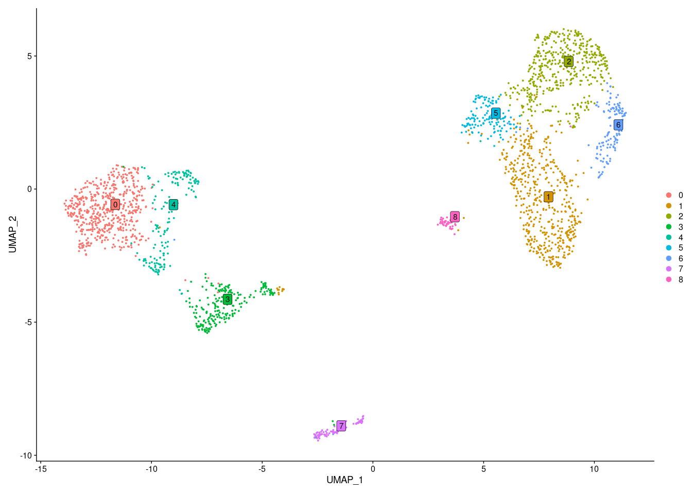
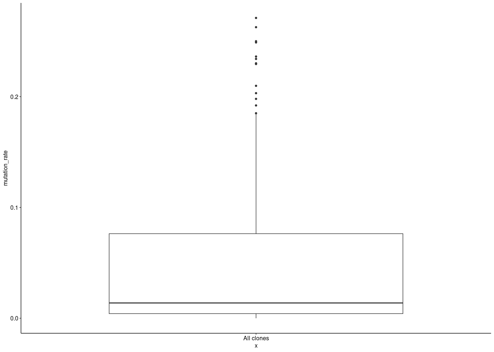
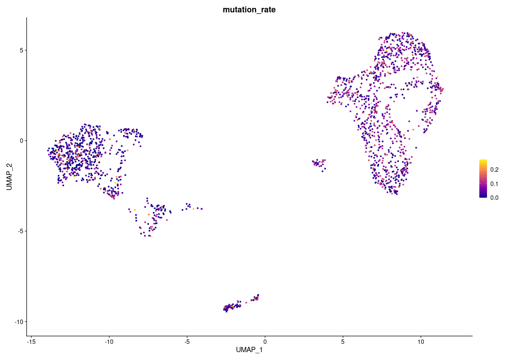
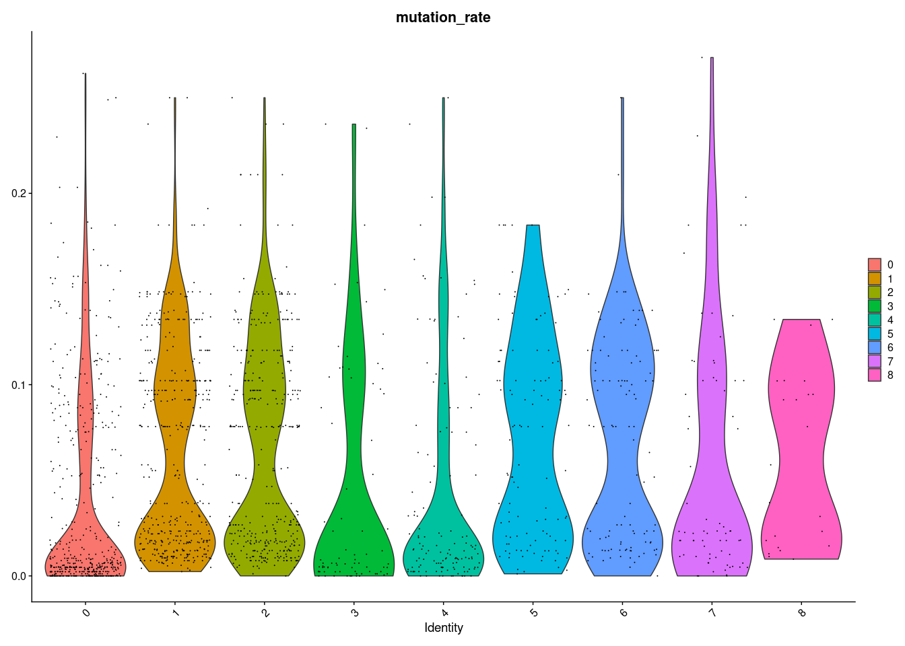
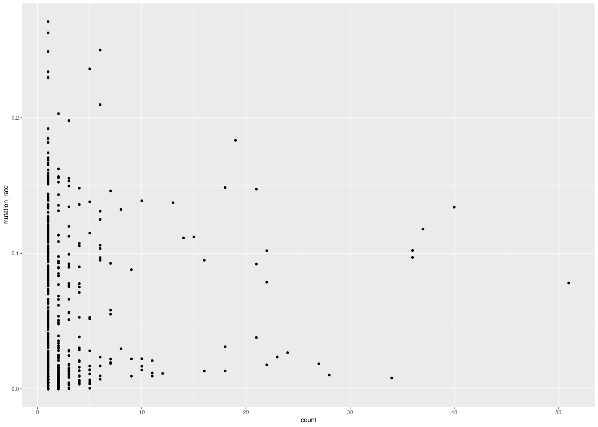
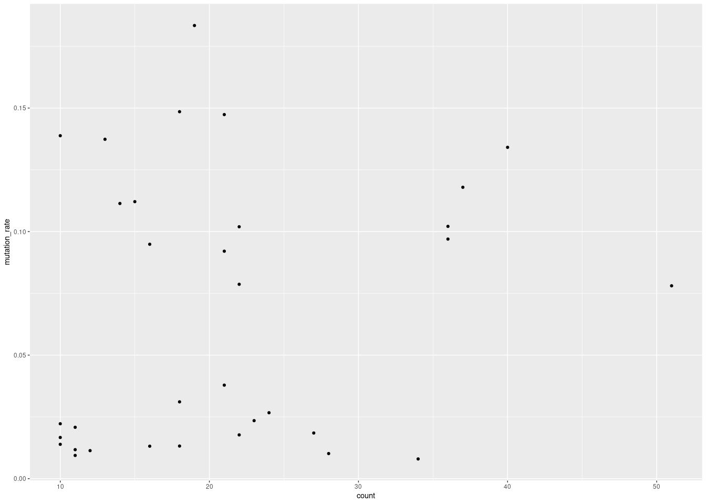
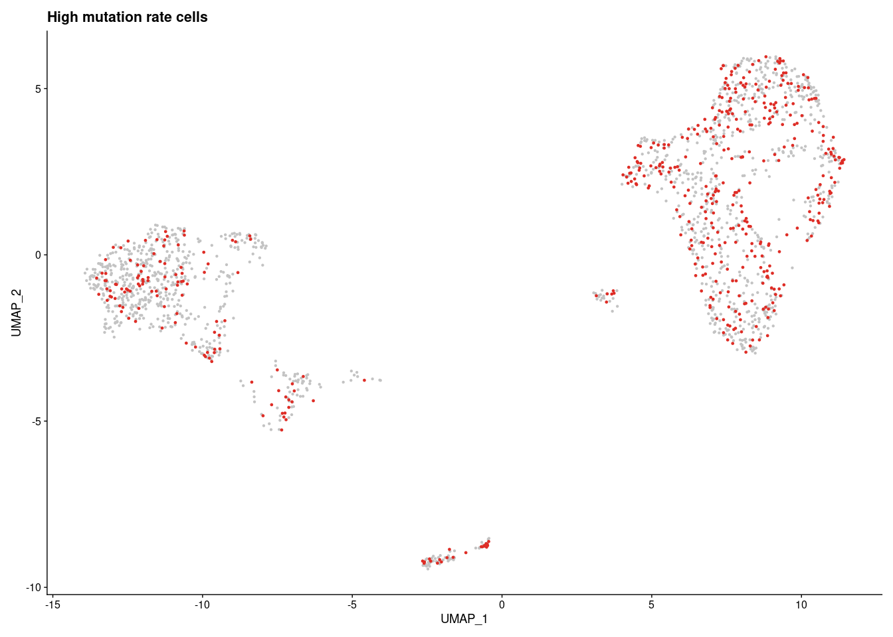
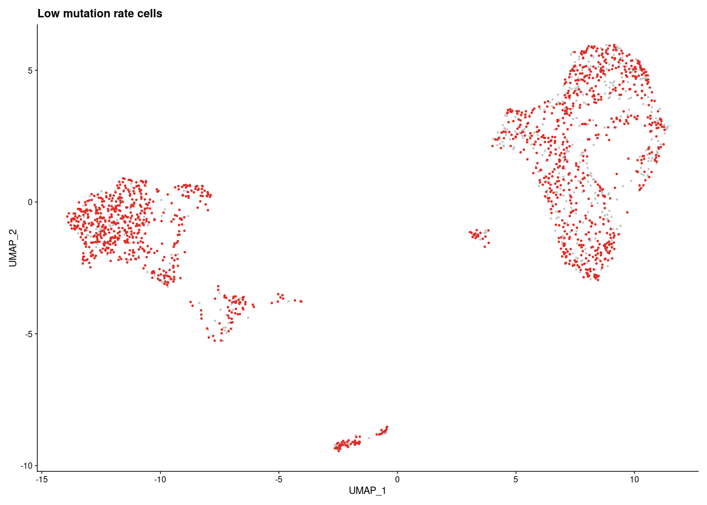
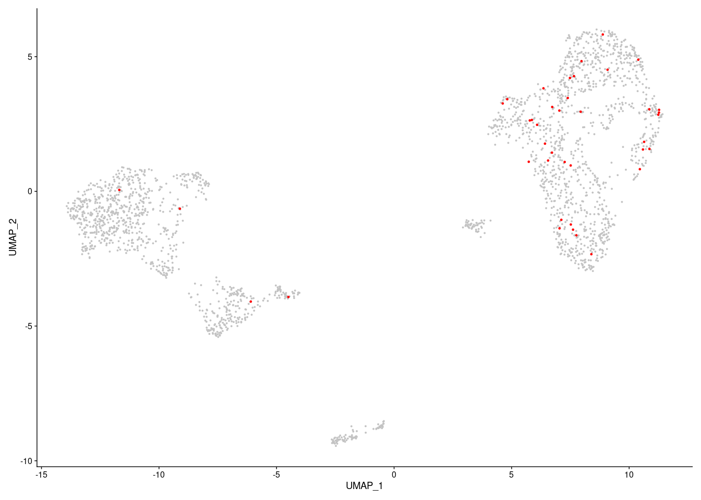

<style type="text/css">
script src = "https://ajax.googleapis.com/ajax/libs/jquery/3.4.1/jquery.min.js"
</style>

<script>
 $(document).ready(function() {
    $('body').prepend('<div class=\"zoomDiv\"></div>');
    // onClick function for all plots (img's)
    $('img:not(.zoomImg)').click(function() {
      $('.zoomImg').attr('src', $(this).attr('src')).css({width: '100%'});
      $('.zoomDiv').css({opacity: '1', width: 'auto', border: '1px solid white', borderRadius: '5px', position: 'fixed', top: '50%', left: '50%', marginRight: '-50%', transform: 'translate(-50%, -50%)', boxShadow: '0px 0px 50px #888888', zIndex: '50', overflow: 'auto', maxHeight: '100%'});
    });
    // onClick function for zoomImg
    $('img.zoomImg').click(function() {
      $('.zoomDiv').css({opacity: '0', width: '0%'}); 
    });
  });
</script>

<style type="text/css">
    div.datatables { height: auto !important;}
</style>


# UMAP

## All samples, grouped by clusters
<!-- -->

## All samples, highlighted cells with clone VDJ information
<!-- -->

# VDJ information


## Distribution of mutation rates in all samples
<!-- -->

## Mutation rate on UMAP
<!-- -->

## Violin plot mutation rate
<!-- -->

## Clone size vs number of mutations
<!-- -->

## Clone size (>= 10) vs number of mutations
<!-- -->


# Differential gene expression analysis between low vs. high mutation rate clones/cells


## UMAP: high mutation rate cells
<!-- -->


<!-- -->

## DGE table

```{=html}
<div id="htmlwidget-f843a680a1fcd62a0dd1" style="width:100%;height:auto;" class="datatables html-widget"></div>
<script type="application/json" data-for="htmlwidget-f843a680a1fcd62a0dd1">{"x":{"filter":"top","vertical":false,"filterHTML":"<tr>\n  <td><\/td>\n  <td data-type=\"character\" style=\"vertical-align: top;\">\n    <div class=\"form-group has-feedback\" style=\"margin-bottom: auto;\">\n      <input type=\"search\" placeholder=\"All\" class=\"form-control\" style=\"width: 100%;\"/>\n      <span class=\"glyphicon glyphicon-remove-circle form-control-feedback\"><\/span>\n    <\/div>\n  <\/td>\n  <td data-type=\"number\" style=\"vertical-align: top;\">\n    <div class=\"form-group has-feedback\" style=\"margin-bottom: auto;\">\n      <input type=\"search\" placeholder=\"All\" class=\"form-control\" style=\"width: 100%;\"/>\n      <span class=\"glyphicon glyphicon-remove-circle form-control-feedback\"><\/span>\n    <\/div>\n    <div style=\"display: none;position: absolute;width: 200px;opacity: 1\">\n      <div data-min=\"0\" data-max=\"1.274633096e-06\" data-scale=\"15\"><\/div>\n      <span style=\"float: left;\"><\/span>\n      <span style=\"float: right;\"><\/span>\n    <\/div>\n  <\/td>\n  <td data-type=\"number\" style=\"vertical-align: top;\">\n    <div class=\"form-group has-feedback\" style=\"margin-bottom: auto;\">\n      <input type=\"search\" placeholder=\"All\" class=\"form-control\" style=\"width: 100%;\"/>\n      <span class=\"glyphicon glyphicon-remove-circle form-control-feedback\"><\/span>\n    <\/div>\n    <div style=\"display: none;position: absolute;width: 200px;opacity: 1\">\n      <div data-min=\"-0.970279178173669\" data-max=\"0.758545150383493\" data-scale=\"15\"><\/div>\n      <span style=\"float: left;\"><\/span>\n      <span style=\"float: right;\"><\/span>\n    <\/div>\n  <\/td>\n  <td data-type=\"number\" style=\"vertical-align: top;\">\n    <div class=\"form-group has-feedback\" style=\"margin-bottom: auto;\">\n      <input type=\"search\" placeholder=\"All\" class=\"form-control\" style=\"width: 100%;\"/>\n      <span class=\"glyphicon glyphicon-remove-circle form-control-feedback\"><\/span>\n    <\/div>\n    <div style=\"display: none;position: absolute;width: 200px;opacity: 1\">\n      <div data-min=\"0.103\" data-max=\"0.996\" data-scale=\"3\"><\/div>\n      <span style=\"float: left;\"><\/span>\n      <span style=\"float: right;\"><\/span>\n    <\/div>\n  <\/td>\n  <td data-type=\"number\" style=\"vertical-align: top;\">\n    <div class=\"form-group has-feedback\" style=\"margin-bottom: auto;\">\n      <input type=\"search\" placeholder=\"All\" class=\"form-control\" style=\"width: 100%;\"/>\n      <span class=\"glyphicon glyphicon-remove-circle form-control-feedback\"><\/span>\n    <\/div>\n    <div style=\"display: none;position: absolute;width: 200px;opacity: 1\">\n      <div data-min=\"0.091\" data-max=\"0.993\" data-scale=\"3\"><\/div>\n      <span style=\"float: left;\"><\/span>\n      <span style=\"float: right;\"><\/span>\n    <\/div>\n  <\/td>\n  <td data-type=\"number\" style=\"vertical-align: top;\">\n    <div class=\"form-group has-feedback\" style=\"margin-bottom: auto;\">\n      <input type=\"search\" placeholder=\"All\" class=\"form-control\" style=\"width: 100%;\"/>\n      <span class=\"glyphicon glyphicon-remove-circle form-control-feedback\"><\/span>\n    <\/div>\n    <div style=\"display: none;position: absolute;width: 200px;opacity: 1\">\n      <div data-min=\"0\" data-max=\"0.040662070370041\" data-scale=\"15\"><\/div>\n      <span style=\"float: left;\"><\/span>\n      <span style=\"float: right;\"><\/span>\n    <\/div>\n  <\/td>\n<\/tr>","extensions":["Buttons"],"data":[["1","2","3","4","5","6","7","8","9","10","11","12","13","14","15","16","17","18","19","20","21","22","23","24","25","26","27","28","29","30","31","32","33","34","35","36","37","38","39","40","41","42","43","44","45","46","47","48","49","50","51","52","53","54","55","56","57","58","59","60","61","62","63","64","65","66","67","68","69","70","71","72","73","74","75","76","77","78","79","80","81","82","83","84","85","86","87","88"],["Ighg1","Ly6d","Rgs13","Basp1","Osbpl3","Gm4316","Txn1","Dbi","Lmo7","Bank1","H1fx","Rassf6","Gcsam","Cd38","Hmgb2","Rbm3","H2afv","Rap1a","Mki67","Foxp1","Cks1b","Btg1","Shisa5","Stmn1","Mef2b","Fscn1","H2afz","Trerf1","Dck","Tox","Cd72","Klhl6","Tyms","Cd79a","Gapdh","Snx2","Lig1","Hmgn2","Anxa2","Dap","Parm1","Bub1b","S1pr2","Mybl1","Hpf1","Neil1","Kpna2","Psip1","Glrx3","S100a10","Pakap.1","Mcm5","Pclaf","Ifi209","S100a11","Ift22","Ran","Dut","Tox2","Rbbp7","Nrgn","Plac8","Nap1l1","Ighm","Rgs10","Ly6e","Fut8","Ptma","Pou2af1","Tmem131","Hells","Hmgb1","Cks2","Mcm3","Mndal","Lmnb1","Cenpe","Mcm6","Lpp","H2afx","Aff3","Top2a","Fcmr","Capg","Tubb5","Birc5","Knl1","Zfp318"],[1.44954006702118e-20,3.14782808283247e-19,8.85034664920203e-15,8.01012887191288e-14,8.52489054858376e-14,6.9126381861749e-13,1.53405372460621e-12,2.93100693280789e-12,7.33631311390675e-12,9.86327213669967e-12,1.23551275097843e-11,2.43382334839056e-11,2.63266344069659e-11,2.81486172343029e-11,2.87962767067615e-11,5.52671282872863e-11,8.62284622863567e-11,1.00869527850795e-10,1.32396864743494e-10,1.42191009469952e-10,1.7276161907649e-10,1.74343779094836e-10,1.92436079260436e-10,2.8294545831235e-10,3.32308114532067e-10,3.65952656037089e-10,4.81563735134937e-10,7.26834693972689e-10,7.3862549118295e-10,9.77658810548221e-10,1.23573406354243e-09,1.49257969942352e-09,1.65851099666616e-09,2.24547182072037e-09,2.61919123342637e-09,2.72888778815315e-09,4.14601047034742e-09,4.26215002983524e-09,4.3917928678021e-09,4.53717633354992e-09,4.94674418702463e-09,5.2971004680589e-09,7.14925441256861e-09,9.73156587868274e-09,1.15320131108462e-08,1.15564408618772e-08,1.17586601918807e-08,1.20384263727875e-08,1.2071886369179e-08,1.24341430433176e-08,1.44184361306128e-08,1.47663363994424e-08,1.53428992513584e-08,2.01584559426717e-08,2.2142190373593e-08,2.25347736760942e-08,2.47333490294392e-08,2.48479647774116e-08,2.52733475900587e-08,2.78252479678131e-08,2.93232032174251e-08,4.17070280040971e-08,4.33934221599539e-08,5.24940855057289e-08,5.71765241206434e-08,5.77584959422673e-08,5.80319583987132e-08,6.86531311323593e-08,7.33037685938743e-08,7.38588370707224e-08,7.98264683227544e-08,8.69448715785674e-08,1.31035480284074e-07,1.79628258969092e-07,2.33489499664667e-07,2.43599514210286e-07,2.61810200229244e-07,3.56153233843874e-07,3.80724325991154e-07,4.18224717699998e-07,4.37391457589231e-07,5.38019288198571e-07,5.91334005404675e-07,6.84147181605564e-07,6.89481270395575e-07,9.74815687001324e-07,1.1775068592035e-06,1.27463309520205e-06],[0.494180547003784,-0.970279178173669,0.409560479619409,0.412703627037003,0.329996079184222,0.372852259898411,0.358485885855565,0.295344203216438,0.453074305988995,-0.44904855826205,0.365808480184446,0.308978229638701,0.37506268753188,-0.518146295008636,0.418871980878467,0.283376366892629,0.328440775610889,0.291212995488194,0.409673332089403,-0.47806723273088,0.309583974238306,-0.457466874800276,-0.607450978185011,0.368116291902604,0.321017354496459,0.328991994506672,0.467160242069078,0.272097736568333,0.276514740402241,0.26753532380708,-0.481957870805719,0.30789115822181,0.259789043966377,-0.297380060861935,0.264317880356075,-0.39543132934873,0.320751488985775,0.317705768855829,0.323364684204323,0.37192647724572,0.311105109550841,0.290652874231733,0.268808307409096,0.27550130665854,0.283825931143265,0.264505754659696,0.327318896015524,0.255188201504886,0.255716119506112,-0.415980192561699,0.297526753103982,0.276386782951027,0.351952039981725,-0.377224357149091,-0.433252752053728,0.255205857331012,0.277359760245703,0.346388866535079,0.267374417799221,0.256128603512993,0.758545150383493,-0.567594930907857,0.259345338353945,-0.804145464566708,0.253665750776216,-0.287800352769117,0.267551623479684,0.267778482712544,0.275493162188768,0.253041788758496,0.26047684588552,0.269070173275303,0.367346708817043,0.255883535683934,-0.483509107537435,0.256768369136486,0.316661491278947,0.317744232807105,0.308151008953873,0.256554531672451,-0.364673347026996,0.330569103206461,-0.488232091366124,-0.395784219123636,0.322155864239092,0.276535792891618,0.267322987612386,-0.26532289094605],[0.259,0.359,0.715,0.768,0.427,0.598,0.774,0.805,0.238,0.791,0.538,0.495,0.583,0.201,0.832,0.928,0.793,0.879,0.657,0.797,0.561,0.854,0.643,0.669,0.77,0.273,0.832,0.552,0.671,0.6,0.341,0.815,0.429,0.996,0.961,0.778,0.532,0.852,0.651,0.674,0.255,0.386,0.577,0.634,0.686,0.674,0.556,0.85,0.805,0.131,0.661,0.581,0.573,0.441,0.277,0.517,0.883,0.657,0.361,0.789,0.248,0.123,0.842,0.503,0.628,0.986,0.719,0.986,0.875,0.799,0.593,0.936,0.61,0.598,0.193,0.696,0.464,0.624,0.754,0.749,0.598,0.552,0.809,0.277,0.877,0.462,0.478,0.103],[0.091,0.578,0.494,0.576,0.255,0.405,0.634,0.635,0.113,0.857,0.361,0.322,0.404,0.364,0.709,0.84,0.633,0.759,0.475,0.828,0.382,0.884,0.725,0.485,0.581,0.146,0.759,0.393,0.484,0.413,0.484,0.696,0.285,0.993,0.948,0.813,0.386,0.751,0.467,0.522,0.143,0.25,0.43,0.463,0.534,0.497,0.413,0.697,0.666,0.257,0.509,0.419,0.415,0.553,0.401,0.374,0.799,0.526,0.234,0.664,0.142,0.239,0.752,0.622,0.485,0.98,0.563,0.981,0.795,0.654,0.429,0.89,0.469,0.454,0.308,0.546,0.329,0.478,0.619,0.6,0.672,0.413,0.826,0.399,0.825,0.334,0.355,0.201],[4.62417776780427e-16,1.00418863670439e-14,2.82334908456194e-10,2.55531121142893e-09,2.71952533390371e-09,2.20520070777165e-08,4.89378478686628e-08,9.35020521635045e-08,2.34035724646739e-07,3.14648244432856e-07,3.9414092268963e-07,7.76413986370071e-07,8.3984596421662e-07,8.97969038391495e-07,9.18630023222398e-07,1.76307665949272e-06,2.75077417539706e-06,3.21783880796822e-06,4.22359238218219e-06,4.53603539310095e-06,5.5112684101591e-06,5.56174089690435e-06,6.13890336448718e-06,9.02624306562227e-06,1.06009611616875e-05,1.16742556802392e-05,1.53623647145396e-05,2.31867535724228e-05,2.35628917942273e-05,3.11882937152988e-05,3.94211523610671e-05,4.76147849913097e-05,5.29081593046471e-05,7.16327965528004e-05,8.35548195375345e-05,8.70542493298736e-05,0.000132261880014553,0.000135966848101774,0.000140102584275755,0.000144740462216576,0.000157806086310273,0.000168982802031547,0.000228068365015351,0.000310446683095858,0.000367882750249106,0.000368662019934744,0.000375113018781186,0.000384037839718295,0.000385105247063178,0.000396661597224875,0.000459962531002679,0.000471060897478613,0.000489453829017585,0.00064307490302717,0.000706358015107991,0.000718881815041081,0.000789018567388139,0.000792674924364207,0.000806245061470462,0.000887653235421204,0.000935439505839078,0.0013304959003587,0.00138429356032469,0.00167461382171826,0.00182398829597265,0.00184255377905427,0.00185127750487735,0.00219010353625339,0.00233846352191318,0.00235617076139312,0.00254654416596419,0.00277362834822788,0.00418016285654223,0.00573032108937301,0.00744854852880254,0.00777106810282232,0.00835200719751311,0.0113616443128534,0.0121454867234438,0.0133417867193476,0.013953224888554,0.0171633533128226,0.0188641461064146,0.0218249792403991,0.0219951420068892,0.0310975952310292,0.0375636463154509,0.0406620703700407]],"container":"<table class=\"display\">\n  <thead>\n    <tr>\n      <th> <\/th>\n      <th>Gene<\/th>\n      <th>p_val<\/th>\n      <th>avg_log2FC<\/th>\n      <th>pct.1<\/th>\n      <th>pct.2<\/th>\n      <th>p_val_adj<\/th>\n    <\/tr>\n  <\/thead>\n<\/table>","options":{"dom":"Blfrtip","buttons":["copy","csv","excel","pdf","print"],"lengthMenu":[[10,25,50,-1],["10","25","50","All"]],"columnDefs":[{"targets":"_all","render":"function(data, type, row, meta) {\nreturn type === 'display' && data != null && data.length > 100 ?\n'<span title=\"' + data + '\">' + data.substr(0, 100) + '...<\/span>' : data;\n}"},{"className":"dt-right","targets":[2,3,4,5,6]},{"orderable":false,"targets":0}],"order":[],"autoWidth":false,"orderClasses":false,"orderCellsTop":true}},"evals":["options.columnDefs.0.render"],"jsHooks":[]}</script>
```

# Differential gene expression analysis between YFP+ and YFP- cells


```{=html}
<div id="htmlwidget-ba32e0541469b5ed4906" style="width:100%;height:auto;" class="datatables html-widget"></div>
<script type="application/json" data-for="htmlwidget-ba32e0541469b5ed4906">{"x":{"filter":"top","vertical":false,"filterHTML":"<tr>\n  <td><\/td>\n  <td data-type=\"character\" style=\"vertical-align: top;\">\n    <div class=\"form-group has-feedback\" style=\"margin-bottom: auto;\">\n      <input type=\"search\" placeholder=\"All\" class=\"form-control\" style=\"width: 100%;\"/>\n      <span class=\"glyphicon glyphicon-remove-circle form-control-feedback\"><\/span>\n    <\/div>\n  <\/td>\n  <td data-type=\"number\" style=\"vertical-align: top;\">\n    <div class=\"form-group has-feedback\" style=\"margin-bottom: auto;\">\n      <input type=\"search\" placeholder=\"All\" class=\"form-control\" style=\"width: 100%;\"/>\n      <span class=\"glyphicon glyphicon-remove-circle form-control-feedback\"><\/span>\n    <\/div>\n    <div style=\"display: none;position: absolute;width: 200px;opacity: 1\">\n      <div data-min=\"4.76093e-10\" data-max=\"1.539509593e-06\" data-scale=\"15\"><\/div>\n      <span style=\"float: left;\"><\/span>\n      <span style=\"float: right;\"><\/span>\n    <\/div>\n  <\/td>\n  <td data-type=\"number\" style=\"vertical-align: top;\">\n    <div class=\"form-group has-feedback\" style=\"margin-bottom: auto;\">\n      <input type=\"search\" placeholder=\"All\" class=\"form-control\" style=\"width: 100%;\"/>\n      <span class=\"glyphicon glyphicon-remove-circle form-control-feedback\"><\/span>\n    <\/div>\n    <div style=\"display: none;position: absolute;width: 200px;opacity: 1\">\n      <div data-min=\"0.27152228378837\" data-max=\"0.896531034527683\" data-scale=\"15\"><\/div>\n      <span style=\"float: left;\"><\/span>\n      <span style=\"float: right;\"><\/span>\n    <\/div>\n  <\/td>\n  <td data-type=\"number\" style=\"vertical-align: top;\">\n    <div class=\"form-group has-feedback\" style=\"margin-bottom: auto;\">\n      <input type=\"search\" placeholder=\"All\" class=\"form-control\" style=\"width: 100%;\"/>\n      <span class=\"glyphicon glyphicon-remove-circle form-control-feedback\"><\/span>\n    <\/div>\n    <div style=\"display: none;position: absolute;width: 200px;opacity: 1\">\n      <div data-min=\"0.275\" data-max=\"0.875\" data-scale=\"3\"><\/div>\n      <span style=\"float: left;\"><\/span>\n      <span style=\"float: right;\"><\/span>\n    <\/div>\n  <\/td>\n  <td data-type=\"number\" style=\"vertical-align: top;\">\n    <div class=\"form-group has-feedback\" style=\"margin-bottom: auto;\">\n      <input type=\"search\" placeholder=\"All\" class=\"form-control\" style=\"width: 100%;\"/>\n      <span class=\"glyphicon glyphicon-remove-circle form-control-feedback\"><\/span>\n    <\/div>\n    <div style=\"display: none;position: absolute;width: 200px;opacity: 1\">\n      <div data-min=\"0.059\" data-max=\"0.463\" data-scale=\"3\"><\/div>\n      <span style=\"float: left;\"><\/span>\n      <span style=\"float: right;\"><\/span>\n    <\/div>\n  <\/td>\n  <td data-type=\"number\" style=\"vertical-align: top;\">\n    <div class=\"form-group has-feedback\" style=\"margin-bottom: auto;\">\n      <input type=\"search\" placeholder=\"All\" class=\"form-control\" style=\"width: 100%;\"/>\n      <span class=\"glyphicon glyphicon-remove-circle form-control-feedback\"><\/span>\n    <\/div>\n    <div style=\"display: none;position: absolute;width: 200px;opacity: 1\">\n      <div data-min=\"1.5187842911e-05\" data-max=\"0.049111895495434\" data-scale=\"15\"><\/div>\n      <span style=\"float: left;\"><\/span>\n      <span style=\"float: right;\"><\/span>\n    <\/div>\n  <\/td>\n<\/tr>","extensions":["Buttons"],"data":[["1","2","3","4","5","6","7","8","9","10","11","12","13","14","15","16","17","18","19","20"],["Slc25a13","Igha","Ehd3","Rnf43","Arl3","D030056L22Rik","Cul4b","Ckap2","H1fx","Aurka","Hjurp","Igf2bp3","Sh2b2","Cks2","Cenpa","Racgap1","Tuba1c","Ckap2l","Lefty1","Rab9"],[4.76093003718446e-10,8.15238580442283e-09,1.44485401748935e-08,1.94090229177626e-08,3.87414319783287e-08,7.46948238437994e-08,1.35769986044157e-07,2.31491128698138e-07,2.77866870508904e-07,2.77962521907282e-07,3.92147907667336e-07,5.93937239544618e-07,7.61461086457022e-07,7.73995336259094e-07,8.39778567545924e-07,8.68491323319152e-07,9.83888156953319e-07,1.32684960084748e-06,1.50934236514052e-06,1.53950959203265e-06],[0.284188846483935,0.35976317809903,0.53098398952744,0.324712477841444,0.323627182017439,0.300411080035776,0.368138700525038,0.457103582598547,0.896531034527683,0.482236472991492,0.5547284161615,0.458244009502719,0.421470838058334,0.876092959536474,0.685960575514628,0.537489277029326,0.822419250336457,0.526095518421387,0.697752011403514,0.271522283788371],[0.4,0.575,0.675,0.275,0.675,0.5,0.675,0.5,0.775,0.525,0.75,0.45,0.725,0.85,0.675,0.65,0.875,0.625,0.525,0.625],[0.095,0.23,0.253,0.059,0.256,0.171,0.279,0.178,0.369,0.189,0.332,0.158,0.339,0.463,0.302,0.297,0.456,0.267,0.219,0.257],[1.51878429116221e-05,0.000260069259546893,0.000460922880119278,0.000619167240099546,0.00123589042154066,0.00238283957544104,0.00433119832479465,0.00738479849659929,0.00886423103610453,0.00886728241136419,0.0125099104024957,0.0189471918787129,0.0242913701190655,0.0246912252220014,0.0267897760832825,0.0277057417052043,0.0313870160949678,0.0423278291166356,0.0481495307903477,0.0491118954954335]],"container":"<table class=\"display\">\n  <thead>\n    <tr>\n      <th> <\/th>\n      <th>Gene<\/th>\n      <th>p_val<\/th>\n      <th>avg_log2FC<\/th>\n      <th>pct.1<\/th>\n      <th>pct.2<\/th>\n      <th>p_val_adj<\/th>\n    <\/tr>\n  <\/thead>\n<\/table>","options":{"dom":"Blfrtip","buttons":["copy","csv","excel","pdf","print"],"lengthMenu":[[10,25,50,-1],["10","25","50","All"]],"columnDefs":[{"targets":"_all","render":"function(data, type, row, meta) {\nreturn type === 'display' && data != null && data.length > 100 ?\n'<span title=\"' + data + '\">' + data.substr(0, 100) + '...<\/span>' : data;\n}"},{"className":"dt-right","targets":[2,3,4,5,6]},{"orderable":false,"targets":0}],"order":[],"autoWidth":false,"orderClasses":false,"orderCellsTop":true}},"evals":["options.columnDefs.0.render"],"jsHooks":[]}</script>
```

## Highlight YFP cells
<!-- -->
